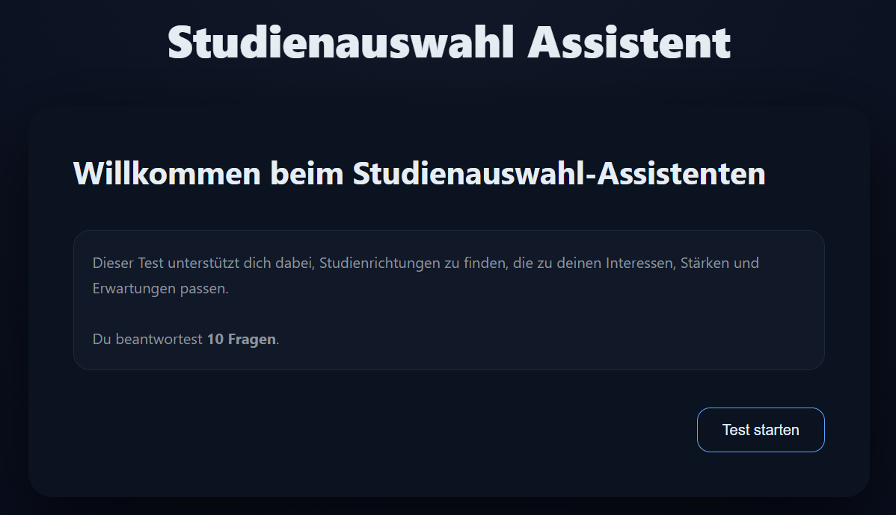
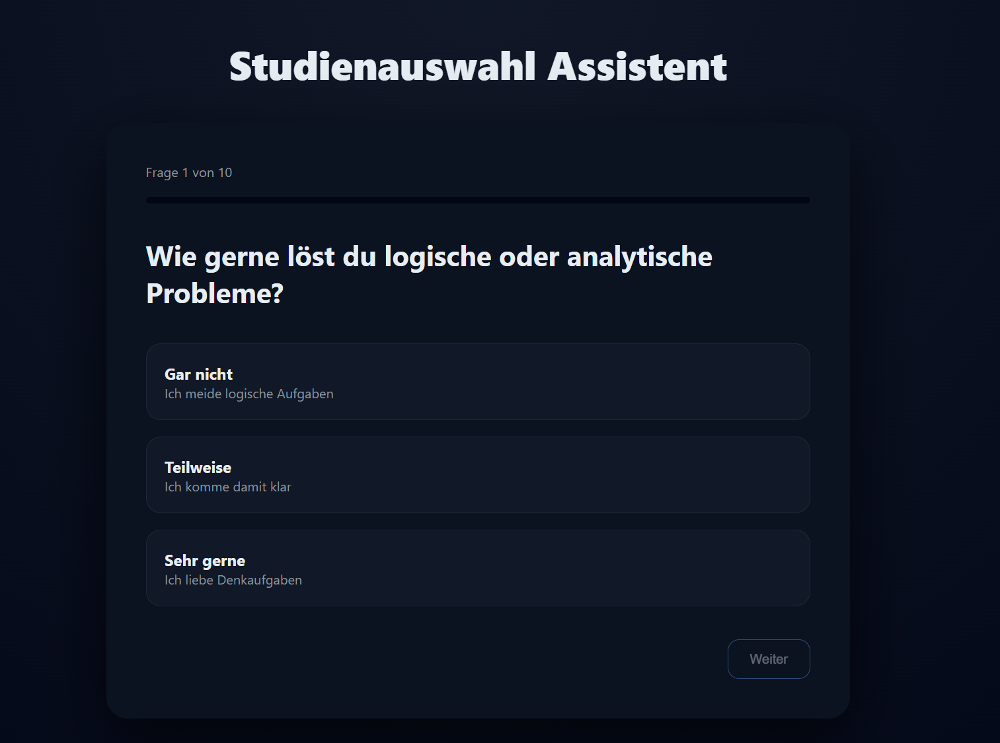
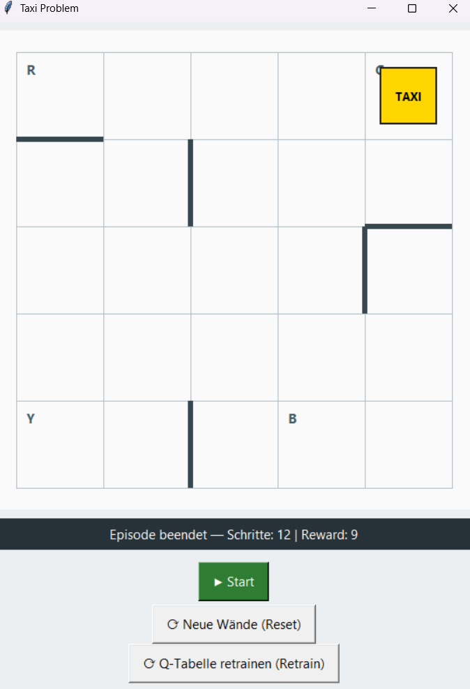
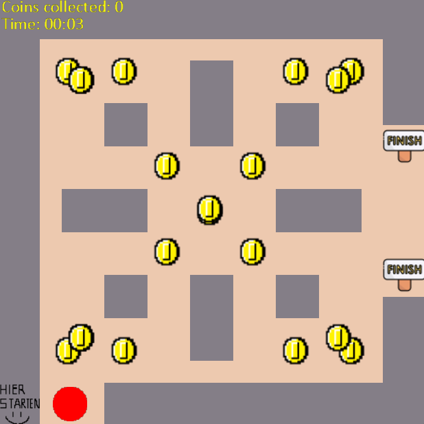

# CHECK24-Projekte – Shiven Dhomne

*Eigene Softwareprojekte zur Studien- und Berufsorientierung*

## Überblick

Dieses Repository enthält drei selbstständig entwickelte Projekte, die ich als Hobby programmiert habe.

## Enthaltene Projekte

### 1. Studienwahl-Assistent 

Ein interaktiver Web-Assistent, der Schüler:innen bei der Entscheidung für ein Studium unterstützt.

Der Nutzer beantwortet mehrere Fragen zu Interessen, Stärken und Erwartungen.
Auf Grundlage dieser Antworten schlägt das System passende Studienrichtungen vor und erklärt nachvollziehbar, wie diese Empfehlung zustande kommt.

**Schwerpunkte:**

* Entscheidungslogik
* Nutzerführung
* transparente und verständliche Auswertung
* Zusammenspiel von Frontend und Backend

**Technik:**
Python (Flask), HTML, CSS, JavaScript

📁 Ordner: `Studienwahl Assistent (Hauptprojekt)`

### 2. Taxi-Problem – Reinforcement-Learning-KI-Agent 

Ein Lernprojekt aus dem Bereich **Künstliche Intelligenz**, bei dem ein Taxi-Agent durch Ausprobieren lernt, einen Passagier sicher an sein Ziel zu bringen.

Das Lernverhalten des Agenten wird über eine grafische Oberfläche sichtbar gemacht.
Dabei wird bewusst gezeigt, dass Lernprozesse nicht sofort perfekt sind und Fehler ein wichtiger Teil des Lernens bleiben.

**Schwerpunkte:**

* Reinforcement Learning
* Q-Learning
* Analyse von Lernverhalten
* Visualisierung von Algorithmen

**Technik:**
Python, Gymnasium, NumPy, Tkinter

📁 Ordner: `Taxi Problem Reinforcement Learning KI-Agent (Hauptprojekt)`

### 3. Labyrinth Escape 
Ein selbst programmiertes Labyrinth-Spiel, bei dem der Spieler Hindernissen ausweichen, Münzen sammeln und schließlich das Ziel erreichen muss.

Das Projekt verbindet **logisches Denken**, **klassische Spielmechaniken** und eine **klare, saubere Code-Struktur**.

**Schwerpunkte:**

* Spielzustände
* Kollisionserkennung
* Nutzerinteraktion
* strukturierter und verständlicher Code

**Technik:**
Python, Arcade

📁 Ordner: `Maze Spiel`
 

## Persönliches Ziel
In diesem Projekt habe ich zum ersten Mal die Prozesse hinter einem Ki-Agenten kennengelernt. Dieses Projekt war sehr herausfordernd, da es sehr viel mathematisches Denken forderte. Trotz dessen war es ein sehr interessantes Projekt.

## Hinweis

Jedes Projekt enthält ein eigenes `README.md` mit:

* einer genauen Erklärung
* der jeweiligen Motivation
* der Funktionsweise
* persönlichen Lernzielen

